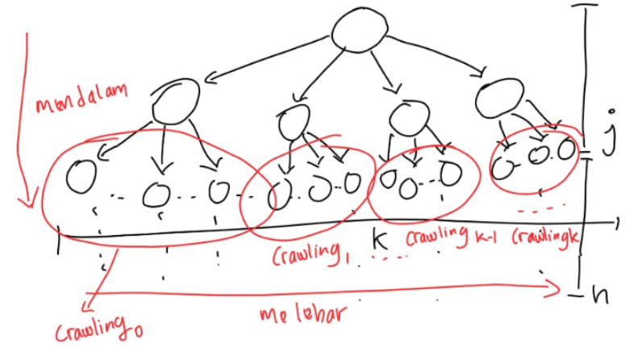

# Tubes2_BE_gass

### Algoritma IDS:

Secara umum konsep iterative deepening search yang diimplementasikan kelompok kami adalah sama dengan konsep IDS pada umumnya, yaitu dengan menggunakan konsep mirip dengan DFS namun ditambahkan batas maksimum penelusuran level pada setiap iterasi pada kedalaman tertentu. Jadi, dengan melalui pendekatan ini, traversal tidak mungkin menjadi infinity (tak hingga). Bisa dimanfaatkan kedalaman yang dilakukan untuk melakukan optimasi terhadap penelurusan graph yang dilakukan. Yang dilakukan secara mendalam kemudian backtracking ke level terakhir pada node yang berada bersebelahan dengan node yang telah ditelusuri secara maksimum pada node sekarang.

### Algoritma BFS:

Adapun algoritma BFS basic yang diimplementasikan pada permasalahan ini ialah dengan melakukan penelusuran secara melebar dimana untuk setiap level dilakukan pembangkitan anak dari masing-masing node yaitu pada saat proses crawling pada scrapping data dari wikipedia. Adapun setiap scrapping tersebut akan dihasilkan depth baru yaitu current depth + 1. Adapun pembangkitan tersebut juga dilakukan setelah proses iterasi pada semua node pada satu level itu telah selesai. Adapun proses tersebut dapat dilihat melalui ilustrasi graph berikut.

------------------

## How to Run Backend

 > Cara 1: Dengan menggunakan `Dockerfile`.

 > Cara 2: Install Go dan menjalankan `go run main.go`.

## How to Run Frontend

 > Cara 1: Dengan menggunakan `Dockerfile`.

 > Cara 2: Install React dan menjalankan `npm run start`.

## Tampilan Website

### Tampilan Menu Input

.png>)

Website	 menyediakan menu inputan:
- Jenis algoritma yang akan digunakan (IDS atau BFS)
- Judul artikel awal
- Judul artikel tujuan
- Kedalaman maksimum untuk IDS
- Checkbox untuk menampilkan semua solusi. 

### Tampilan Output

Website menampilkan hasil dari masukkan user. 

Informasi yang diberikan:
- Apakah artikel berhasil ditemukan
- Waktu yang diperlukan untuk mencari jalur antar artikel
- Banyak artikel yang diperiksa
- Banyak artikel yang dilewati
- Banyak rute yang ditemukan antar kedua artikel tersebut
- Graf yang memvisualisasikan rute tersebut

### Author

| Nama | NIM |
| ---- | --- |
| Muhammad Gilang Ramadhan | 13520137 |
| Kharris Khisunica | 13522051 |